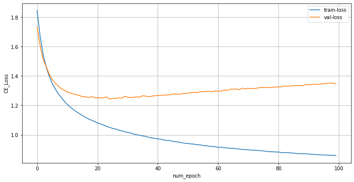

# Voice-Seperation-CNN

## Implementation of project
```bash
git clone https://github.com/kun-woo-park/Voice-Seperation-CNN-DACON.git
cd Voice-Seperation-CNN-DACON
python3 Voice_seperation_CNN.py
```

## 구현 목적
데이콘에서 진행되었던 음성중첩 분리 학습을 위해 진행되었다. 총 10만개의 음성데이터를 이용하여 학습하고, 이 10만개의 음성 데이터 내에 어떤 단어들이 있는지 구분해 내는것이 목적이다.
해당 데이터는 다음 링크에서 받을 수 있다. 

https://dacon.io/competitions/official/235616/overview/

## 구현 내용
음성 중첩된 데이터들을 가공하는 방법으로 Mel spectogram을 사용하였다. Mel spectogram을 형성하는데는 torchaudio의 함수를 사용하였다. 사용한 factor는 다음 코드와 같다.
```python
mel_spectrogram = nn.Sequential(
    AT.MelSpectrogram(sample_rate=16000, 
                      n_fft=512, 
                      win_length=400,
                      hop_length=160,
                      n_mels=80),
    AT.AmplitudeToDB()
)
```
네트워크는 CNN의 형식을 채택했으며, 네트워크는 다음과 같이 구현하였다.
```python
class VRModel(torch.nn.Module):
    def __init__(self):
        super(VRModel, self).__init__()
        self.layer_1 = nn.Conv2d(1,8,(4,5),2)
        self.act_1 = nn.ReLU()
        
        self.layer_2 = nn.Conv2d(8,16,(4,5),2)
        self.act_2 = nn.ReLU()
        
        self.layer_3 = nn.Conv2d(16,32,(4,5))
        self.act_3 = nn.ReLU()
        
        self.layer_4 = nn.Conv2d(32,64,(4,4))
        self.act_4 = nn.ReLU()
        
        self.layer_5 = nn.Conv2d(64,64,(3,4),(2,3))
        self.act_5 = nn.ReLU()

        
        self.fc_layer_1 = nn.Linear(25*64,256)
        self.act_7 = nn.ReLU()
        
        self.bnm1=nn.BatchNorm1d(256)
        
        self.fc_layer_2 = nn.Linear(256,256)
        self.act_8 = nn.ReLU()
        
        self.bnm2=nn.BatchNorm1d(256)
        
        self.fc_layer_3 = nn.Linear(256,256)
        self.act_9 = nn.ReLU()
        
        self.bnm3=nn.BatchNorm1d(256)
        
        self.fc_layer_4 = nn.Linear(256,30)
        
        self.act_10=torch.nn.Softmax(dim=1)
        
        

    def forward(self, x):
        x = x.view(batch_size//num_gpus,1,80,101)
        out = self.layer_1(x)
        out = self.act_1(out)
        for module in list(self.modules())[2:-11]:
            out = module(out)
        out = out.view(batch_size//num_gpus,-1)
        for module in list(self.modules())[-11:]:
            out = module(out)
        return out
```
Batch size = 256, Epoch = 100으로 설정하여 학습을 진행하였다.

## 구현 결과

결과를 보면, 9 Epoch 즈음까지 Valloss가 수렴하다가, 이후 발산하는 양상을 볼 수 있다. 따라서 9 Epoch 까지는 Well-fitted 되어있었으나 이후 overfitting이 발생했다고 예측한다. 해당 모델에 대한 데이콘 결과는 loss 1.36987가 나왔고, 총 396팀중 34등으로 순위권내에는 위치하지 못하였으나, 첫 데이콘 도전에 의의가 있다고 생각된다.   .
